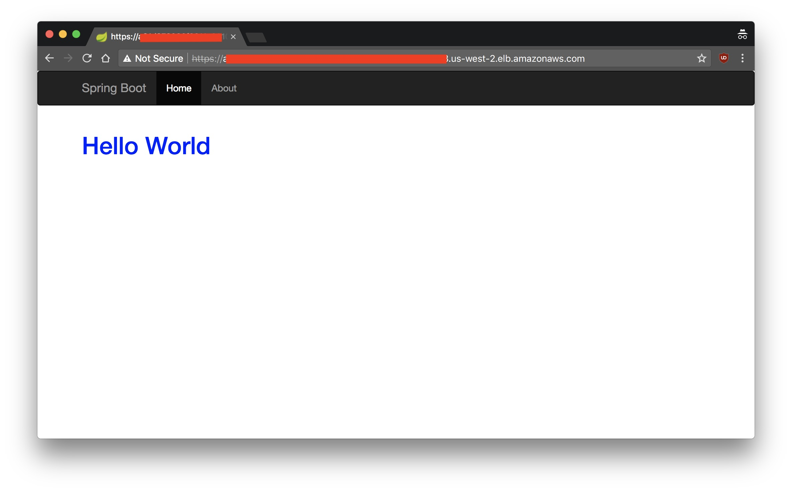

## Setup and Orchestrating of `helloworld` service on Kubernetes

### Base setup:

* Kubernetes (k8s) HA setup running on AWS managed via. [KOPS](https://github.com/kubernetes/kops).

The S3, IAM and Route 53 setup are done as per the documentation. 

A Highly available (HA) Cluster on 3 Availability Zones (AZ's) can be created with the following parameters:

````
$ export NAME=kops-spike.shyamsundar.org
$ export KOPS_STATE_STORE=s3://kops-shyamsundar-org-spike-state-store

$ kops create cluster \
    --node-count 3 \
    --zones us-west-2a,us-west-2b,us-west-2c \
    --master-zones us-west-2a,us-west-2b,us-west-2c \
    --node-size t2.large \
    --master-size t2.large \
    --topology private \
    --networking weave \
    --dns-zone kops-spike.shyamsundar.org \
    --bastion \
    ${NAME}

$ kops update cluster ${NAME} --yes
````

* Ingress with `kube-ingress-aws-controller`. Refer [this URL for configuration](https://github.com/kubernetes/kops/blob/master/addons/kube-ingress-aws-controller/README.md).

* Validation and Status checks:

````
$ kops validate cluster
Using cluster from kubectl context: kops-spike.shyamsundar.org

Validating cluster kops-spike.shyamsundar.org

INSTANCE GROUPS
NAME      ROLE  MACHINETYPE MIN MAX SUBNETS
bastions    Bastion t2.micro  1 1 utility-us-west-2a,utility-us-west-2b,utility-us-west-2c
master-us-west-2a Master  t2.large  1 1 us-west-2a
master-us-west-2b Master  t2.large  1 1 us-west-2b
master-us-west-2c Master  t2.large  1 1 us-west-2c
nodes     Node  t2.large  3 3 us-west-2a,us-west-2b,us-west-2c

NODE STATUS
NAME            ROLE  READY
ip-x-y-35-177.us-west-2.compute.internal  master  True
ip-x-y-42-188.us-west-2.compute.internal  node  True
ip-x-y-69-246.us-west-2.compute.internal  master  True
ip-x-y-72-157.us-west-2.compute.internal  node  True
ip-x-y-97-0.us-west-2.compute.internal  node  True
ip-x-y-99-227.us-west-2.compute.internal  master  True

Your cluster kops-spike.shyamsundar.org is ready
````
````
$ kubectl cluster-info
Kubernetes master is running at https://api.kops-spike.shyamsundar.org
KubeDNS is running at https://api.kops-spike.shyamsundar.org/api/v1/namespaces/kube-system/services/kube-dns:dns/proxy
````

### Creating `helloworld` Deployment:

In Kubernetes, a `Deployment` that configures a `ReplicaSet` is the recommended way to run a stateless application. `Service` can be configured for ingress within clusters and from external world. High-Availability and Scaling (Replicasets), Updates (Rolling Updates) can be easily updated at run-time.

The below deployment and service defenition file will create a deployment that has an replicaset of 3 pods (instances) of the `helloworld` application. They are exposed via ELB on both HTTP/HTTPS with a certificate referenced from AWS Certificate Manager (ACM). (Note: The SSL cert. ARN has to be updated with a real one before running this.)

````
$ cat helloworld-deployment-and-service.yml
apiVersion: apps/v1beta2
kind: Deployment
metadata:
  name: helloworld-deployment
spec:
  selector:
    matchLabels:
      app: helloworld
  replicas: 3
  template:
    metadata:
      labels:
        app: helloworld
    spec:
      containers:
      - name: helloworld
        image: shyam/helloworld:v1
        ports:
        - containerPort: 8080
---
apiVersion: v1
kind: Service
metadata:
  name: helloworld-svc
  annotations:
    service.beta.kubernetes.io/aws-load-balancer-ssl-ports: "443"
    service.beta.kubernetes.io/aws-load-balancer-ssl-cert: "arn:aws:acm:us-west-2:xxxxx:certificate/xxxx-xxx-xxx-xxx-xxxx"
    service.beta.kubernetes.io/aws-load-balancer-backend-protocol: "http"
spec:
  selector:
    app: helloworld
  ports:
    - name: http
      protocol: TCP
      port: 80
      targetPort: 8080
    - name: https
      protocol: TCP
      port: 443
      targetPort: 8080
  type: LoadBalancer
````

The following command will create the deployment and configure the service. 

````
$ kubectl apply -f helloworld-deployment-and-service.yml
deployment "helloworld-deployment" created
service "helloworld-svc" created
````

Verify if the deployments, replicasets, pods and service are created.

````
$ kubectl get deployments
NAME                    DESIRED   CURRENT   UP-TO-DATE   AVAILABLE   AGE
helloworld-deployment   3         3         3            3           2m
````

````
$ kubectl get rs
NAME                               DESIRED   CURRENT   READY     AGE
helloworld-deployment-5f7486f749   3         3         3         2m
````

````
$ kubectl get pods
NAME                                     READY     STATUS    RESTARTS   AGE
helloworld-deployment-5f7486f749-4rsm4   1/1       Running   0          3m
helloworld-deployment-5f7486f749-nhmxg   1/1       Running   0          3m
helloworld-deployment-5f7486f749-tqrpx   1/1       Running   0          3m
````

````
$ kubectl get svc
NAME             TYPE           CLUSTER-IP     EXTERNAL-IP        PORT(S)                      AGE
helloworld-svc   LoadBalancer   100.70.98.55   a61d978090f28...   80:32154/TCP,443:30310/TCP   3m
kubernetes       ClusterIP      100.64.0.1     <none>             443/TCP                      8d
````

Describe the service to get the ELB CNAME.

````
$ kubectl describe svc helloworld-svc
Name:                     helloworld-svc
Namespace:                default
Labels:                   <none>
Annotations:              kubectl.kubernetes.io/last-applied-configuration={"apiVersion":"v1","kind":"Service","metadata":{"annotations":{"service.beta.kubernetes.io/aws-load-balancer-backend-protocol":"http","service.beta.kub...
                          service.beta.kubernetes.io/aws-load-balancer-backend-protocol=http
                          service.beta.kubernetes.io/aws-load-balancer-ssl-cert=arn:aws:acm:us-west-2:xxxxx:certificate/xxxx-xxx-xxx-xxx-xxxx
                          service.beta.kubernetes.io/aws-load-balancer-ssl-ports=443
Selector:                 app=helloworld
Type:                     LoadBalancer
IP:                       100.70.98.55
LoadBalancer Ingress:     a61d978090f28XXXXXXXXXXXXXXXXXXXXX.us-west-2.elb.amazonaws.com
Port:                     http  80/TCP
TargetPort:               8080/TCP
NodePort:                 http  32154/TCP
Endpoints:                100.100.0.2:8080,100.108.0.2:8080,100.116.0.2:8080
Port:                     https  443/TCP
TargetPort:               8080/TCP
NodePort:                 https  30310/TCP
Endpoints:                100.100.0.2:8080,100.108.0.2:8080,100.116.0.2:8080
Session Affinity:         None
External Traffic Policy:  Cluster
Events:
  Type    Reason                Age   From                Message
  ----    ------                ----  ----                -------
  Normal  EnsuringLoadBalancer  4m    service-controller  Ensuring load balancer
  Normal  EnsuredLoadBalancer   4m    service-controller  Ensured load balancer
````

Finally visiting the ELB URL should yield a screen similar to the one below.

 

A DNS CNAME record can be added against the ELB URL so that the SSL validation errors not occur.

### Updating `helloworld` Deployment:

Whenever a new version of the application is to updated, a new tag of the container is obtained and pushed to the registry.

One way to updating the service is to have the deployment service defenition to reflect the new version of the container tag. (Example: The `.spec.template.spec.containers[0].image` now has value `shyam/helloworld:v2`).

````
$ cat helloworld-deployment-and-service.yml
apiVersion: apps/v1beta2
kind: Deployment
metadata:
  name: helloworld-deployment
spec:
  selector:
    matchLabels:
      app: helloworld
  replicas: 3
  template:
    metadata:
      labels:
        app: helloworld
    spec:
      containers:
      - name: helloworld
        image: shyam/helloworld:v2
        ports:
        - containerPort: 8080
---
apiVersion: v1
kind: Service
metadata:
  name: helloworld-svc
  annotations:
    service.beta.kubernetes.io/aws-load-balancer-ssl-ports: "443"
    service.beta.kubernetes.io/aws-load-balancer-ssl-cert: "arn:aws:acm:us-west-2:xxxxx:certificate/xxxx-xxx-xxx-xxx-xxxx"
    service.beta.kubernetes.io/aws-load-balancer-backend-protocol: "http"
spec:
  selector:
    app: helloworld
  ports:
    - name: http
      protocol: TCP
      port: 80
      targetPort: 8080
    - name: https
      protocol: TCP
      port: 443
      targetPort: 8080
  type: LoadBalancer
````

Now applying the configuration will instantiate the new containers and decomission the older containers. The service (loadbalancer) is automatically pointed to the new containers. Note that the service will remain unchanged whereas the deployment will be reconfigured.

````
$ kubectl apply -f helloworld-deployment-and-service.yml
deployment "helloworld-deployment" configured
service "helloworld-svc" unchanged
````

````
$ kubectl rollout status deployment/helloworld-deployment
deployment "helloworld-deployment" successfully rolled out
````

By default the strategy employed by k8s for updating the container is to do rolling updates. (A new replication controller is created and increases the replicas with new image, while simultaneouly the existing replication controller will decrease the replicas with current/older image).

The following command will help us understand the rollout history for a deployment.

````
$ kubectl rollout history deployment/helloworld-deployment
deployments "helloworld-deployment"
REVISION  CHANGE-CAUSE
1         <none>
2         <none>

$ kubectl rollout history deployment/helloworld-deployment --revision=1
deployments "helloworld-deployment" with revision #1
Pod Template:
  Labels: app=helloworld
  pod-template-hash=1930429305
  Containers:
   helloworld:
    Image:  shyam/helloworld:v1
    Port: 8080/TCP
    Environment:  <none>
    Mounts: <none>
  Volumes:  <none>

$ kubectl rollout history deployment/helloworld-deployment --revision=2
deployments "helloworld-deployment" with revision #2
Pod Template:
  Labels: app=helloworld
  pod-template-hash=713233154
  Containers:
   helloworld:
    Image:  shyam/helloworld:v2
    Port: 8080/TCP
    Environment:  <none>
    Mounts: <none>
  Volumes:  <none>
````

Kubernetes (k8s) also supports recreate update strategy (kill existing containers first and deploy new containers) and rollbacks.

Based on the above, it would be fairly easier to model a Continuous Deployment system to manage the delivery of software.
